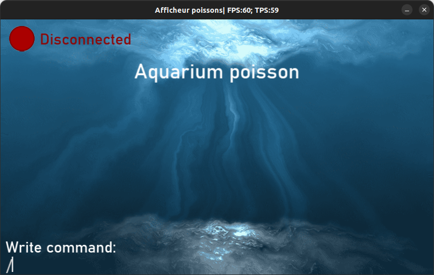
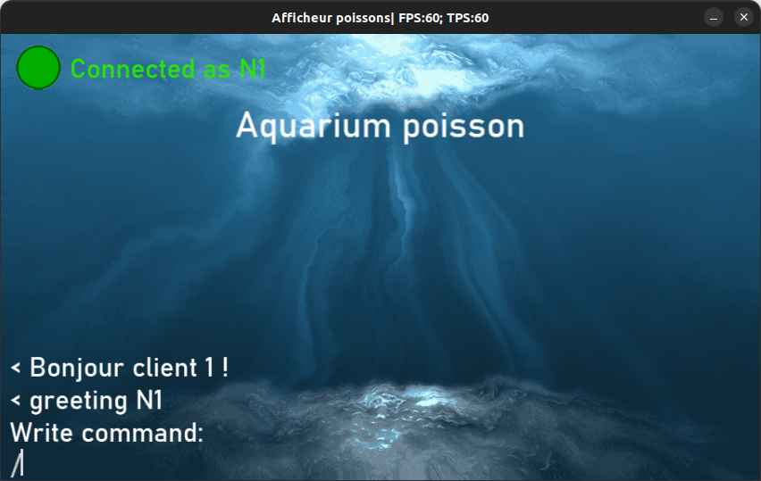
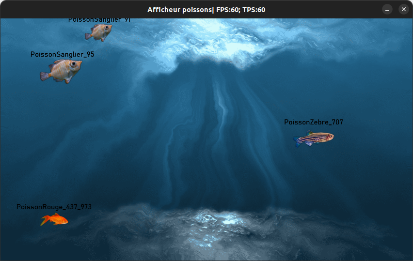
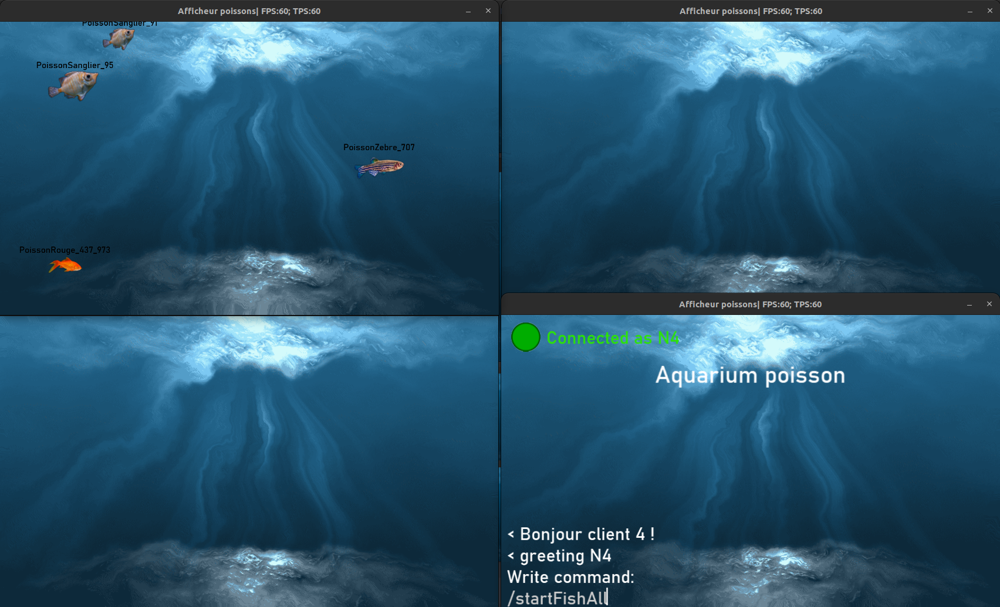
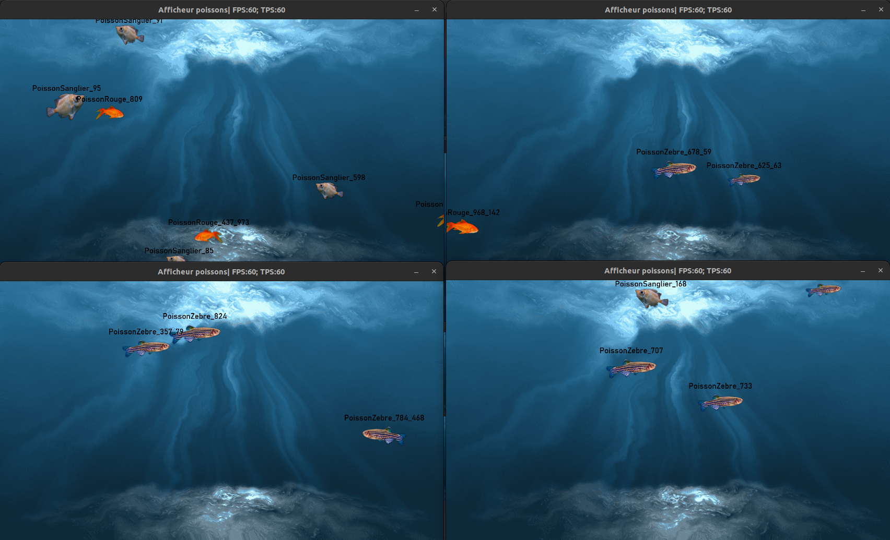

# Projet Réseaux RE203 : "Simulation d'un aquarium de poissons"

## Aquamen Team

PAUL Maël  
LADAGNOUS Louis-Victor  
LAM Mathieu  
BAZIN Maxence  
PRZYBYLSKI Nicolas  

 

## Ressources

Sujet :  
https://docs.google.com/document/d/1MzZG0qDfVr8U50v8X79yvaPfToj8Yz4DwiGg3swl1kk/edit  
Cours :  
https://moodle.bordeaux-inp.fr/pluginfile.php/165937/mod_resource/content/1/Cours%20RE218%202020_2021.pdf

 

## Lauch our Java client

Follow these steps : 

- It would be easier to use IntelliJ IDEA software, Community Edition version.

- Once installed, open the Java project located in the "AfficheurPoisson" folder at the root.

- With the project open, search for the file hierarchy on the left.

- Right-click on the "resources" folder under "AfficherPoisson" and select "Mark Directory As" -> "Resources Root".

- Right-click on the "src" folder under "AfficherPoisson" and select "Mark Directory As" -> "Sources code Root".

- Create a folder named "out" under "AfficherPoisson". Right-click on it and select "Mark Directory As" -> "Excluded".

- Now you need to set up your SDK. Go to "File" -> "Project Settings" and select the "Project" tab.

- Choose the path of the SDK (version 11 or higher), set the language level to 11, and choose an output folder (the "out" folder you created).

- Still in "Project Settings," you need to link the libraries used by our project.

- Go to the "Libraries" tab, click on the "+" button, select "Java," and choose the folder "AfficheurPoisson/lib/lwjgl-3.2.3".

- The last thing to do is to inform the software which Java file should be the main one.

- Open "src/ProjetPoisson/projet/main/Main.java" and click on the green triangle on the left of the main function.

- Now the project is set up. In the top right corner, you can find the "Main" name and another green triangle. Click on it, and it will launch the application.

 

## Compiling the java client

The steps mentioned above should have already been completed.

Follow these steps : 

- To continue, navigate back to the "Project Settings" folder. This time, go to the "Artifacts" tab and click on the "+" button. Select "Java" and choose the module with dependencies.

- A window should appear, allowing you to choose the main classes. Look for the "Main" file in the preview pane.

- Change the directory of "META-INF/MANIFEST.MF" to "src/ProjetPoisson/". Then click on "OK," "Apply," "OK," and close the windows.

- From now on, whenever you want to build, you need to launch the application first. Then click on "Build" -> "Build Artifacts" and select "Build."

- After a short while, the software will inform you that the compilation is finished and whether there were any compilation errors (ideally, there should be none).

- The generated .jar file can be found in "out/artifacts/AfficheurPoisson_jar."

- The last step is to copy the "resources" folder and paste it alongside the generated jar.

- Now open a terminal in the "AfficheurPoisson" folder. Run the command "java -jar out/artifacts/AfficheurPoisson_jar/AfficheurPoisson.jar &" as many times as you want clients to be open.

 

## Preview of client

 

**Disconnected client**

 

**Connected client**

 

**4 fishes added to the aquarium**

 

**Start fishes with corresponding command**

 

**Fishes swim through all the views (client)**

